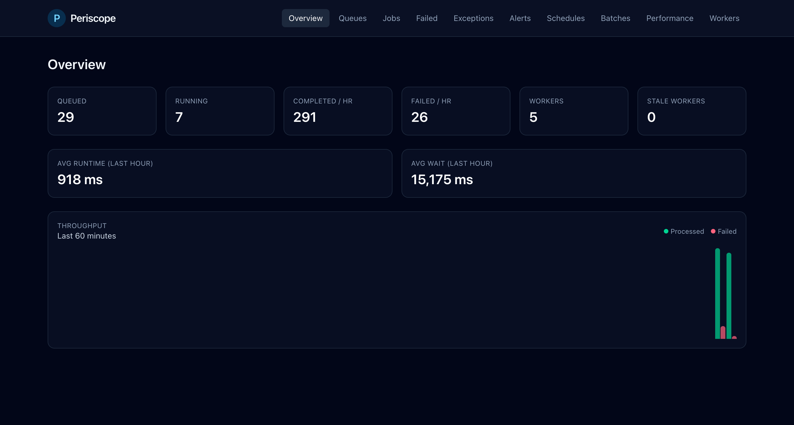
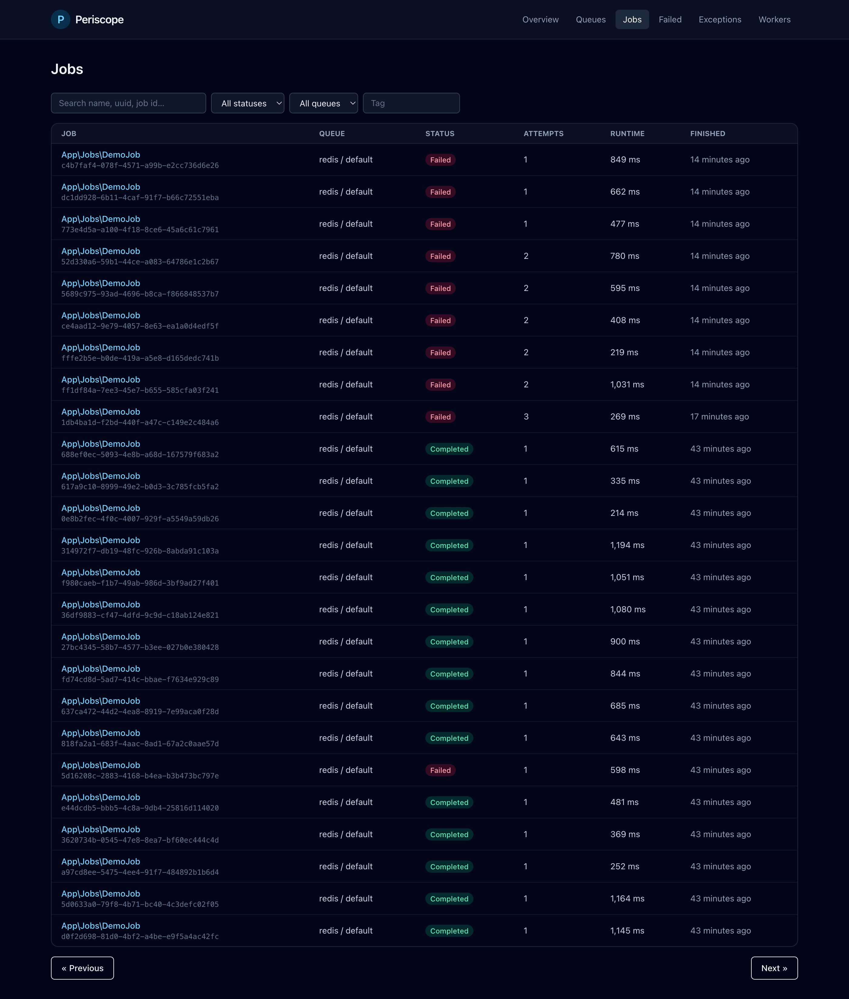
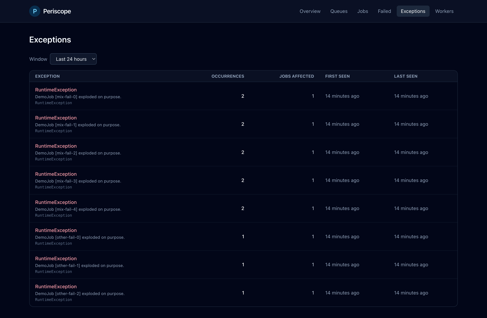
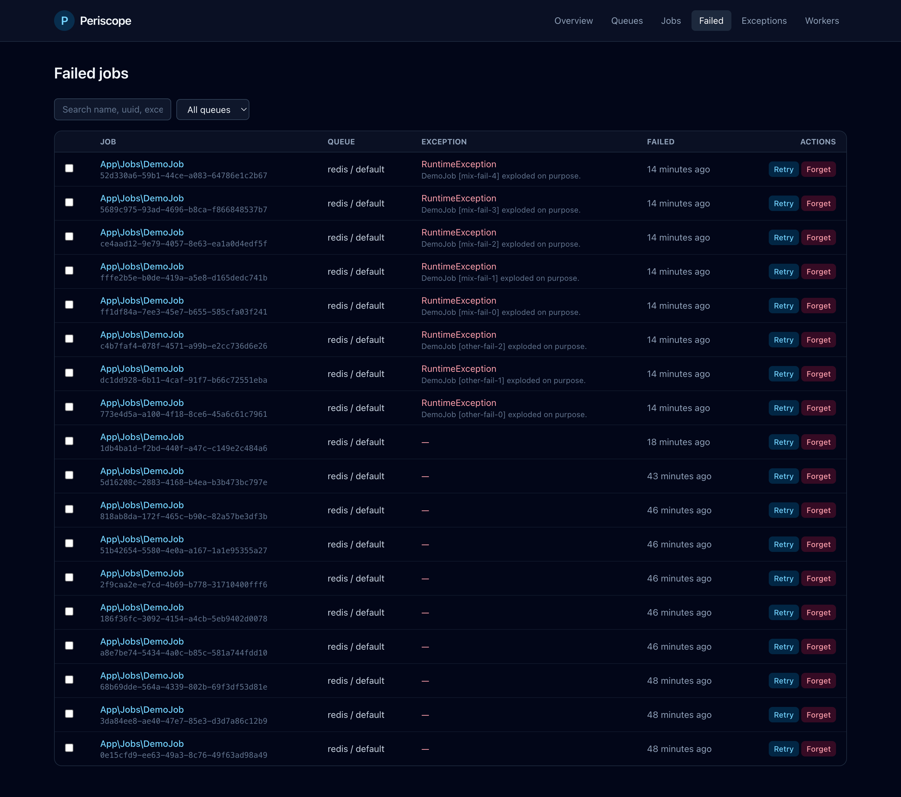
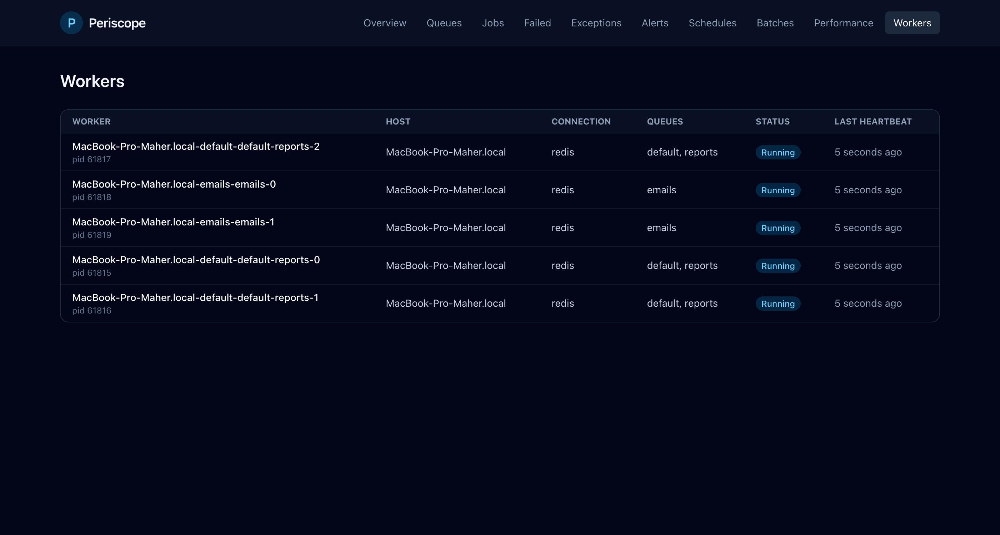
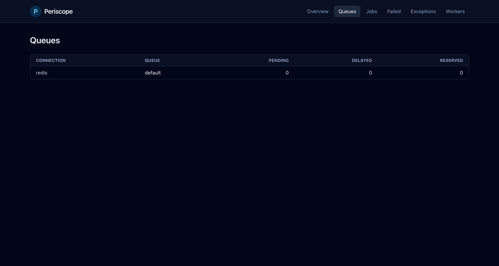

# Periscope

[](https://packagist.org/packages/maherelgamil/periscope)
[](https://github.com/maherelgamil/periscope/actions/workflows/tests.yml)
[](https://packagist.org/packages/maherelgamil/periscope)
[](LICENSE)

> See into any queue.

Periscope is a universal queue monitor for Laravel — a driver-agnostic alternative to Laravel Horizon. It works with **any** queue driver: Redis, database, SQS, Beanstalkd, and more, because it collects telemetry through Laravel's built-in queue events rather than reading driver-specific internals.



## Contents

- [Features](#features)
- [Requirements](#requirements)
- [Installation](#installation)
- [Running workers](#running-workers)
- [Scheduling](#scheduling)
- [Authorization](#authorization)
- [Metrics endpoint](#metrics-endpoint-prometheus--json)
- [Alerts](#alerts)
- [Tags](#tags)
- [Commands](#commands)
- [Screenshots](#screenshots)
- [Testing](#testing)
- [Contributing](#contributing)
- [License](#license)

## Features

- **Universal** — works with `redis`, `database`, `sqs`, `beanstalkd`, and `sync` queue drivers
- **Real-time dashboard** built on Livewire 4 + Tailwind 4 — no CDN, ships with a compiled CSS bundle
- **Per-attempt tracking** — every retry recorded with its runtime and exception, shown as a timeline on the job detail page
- **Grouped exceptions** — aggregate by class + message so you see "this `RuntimeException` hit 47 times" instead of 47 rows
- **Live queue depth** via driver adapters — pending, delayed, and reserved counts on the Queues page
- **Throughput chart** — last 60 minutes of processed vs failed jobs, polled every 10s
- **Worker pools** — config-driven supervisors with optional auto-balance that moves processes between queues based on backlog depth
- **Lifecycle control** — `start` / `pause` / `continue` / `terminate` for deploy-friendly operation
- **Failed job management** — search, filter, retry, forget, and bulk actions
- **Alerts** — failure spike, long wait, stale worker; delivered via mail, Slack, or webhook
- **Prometheus + JSON metrics endpoint** for external monitoring stacks (Grafana, Datadog, etc.)
- **Authorization gate** — `viewPeriscope` ability, scoped to `local` by default
- **Rolling metrics** — per-minute buckets rolled up into hourly, with configurable retention per tier
- **Tag filtering** via Laravel's `Queueable::tags()`

## Requirements

- PHP 8.2+
- Laravel 11, 12, or 13
- Livewire 4

## Installation

```bash
composer require maherelgamil/periscope
php artisan periscope:install
php artisan migrate
```

Visit `/periscope` in your browser. The dashboard is gated to `local` environment by default — see [Authorization](#authorization) to expose it elsewhere.

## Running workers

Workers must be launched through Periscope so heartbeats show up on the Workers page.

### A single worker

```bash
php artisan periscope:supervise redis --queue=default,emails
```

Same flags as `queue:work` (`--tries`, `--timeout`, `--memory`, `--max-jobs`, `--max-time`, etc.).

### Config-driven pools (recommended)

Define supervisors in `config/periscope.php`:

```php
'supervisors' => [
    'default' => [
        'connection' => 'redis',
        'queue' => ['default', 'emails'],
        'processes' => 4,
        'tries' => 1,
        'timeout' => 60,
        'sleep' => 1,
    ],
    'notifications' => [
        'connection' => 'redis',
        'queue' => ['notifications'],
        'processes' => 2,
    ],
],
```

Start every pool with:

```bash
php artisan periscope:start
```

The master process respawns any child that crashes and shuts children down cleanly on SIGTERM / SIGINT. Run with `--supervisor=default` to start only a specific pool.

### Auto-balance mode

Set `balance: 'auto'` and Periscope allocates processes per queue proportional to live queue depth on each cycle, clamped between `min_processes` and `max_processes`:

```php
'default' => [
    'connection' => 'redis',
    'queue' => ['high', 'default', 'low'],
    'balance' => 'auto',
    'min_processes' => 1,
    'max_processes' => 10,
],
```

When all queues are empty, each queue runs `min_processes` workers. When backlog grows, processes are moved toward the busiest queues automatically.

### Deploy-friendly lifecycle

```bash
# Stop spawning new workers; let running ones drain
php artisan periscope:pause

# Resume
php artisan periscope:continue

# Shut the master down entirely (use this in your deploy script)
php artisan periscope:terminate
```

## Scheduling

Add the housekeeping commands to `routes/console.php`:

```php
use Illuminate\Support\Facades\Schedule;

Schedule::command('periscope:workers:sweep')->everyMinute();
Schedule::command('periscope:snapshot')->hourly();
Schedule::command('periscope:alerts:check')->everyFiveMinutes();
Schedule::command('periscope:prune')->daily();
```

## Authorization

The dashboard is gated by the `viewPeriscope` ability. The default definition allows access only in the `local` environment; override it in a service provider:

```php
use Illuminate\Support\Facades\Gate;

Gate::define('viewPeriscope', fn ($user) => $user?->is_admin === true);
```

The metrics endpoint bypasses this gate — see below.

## Metrics endpoint (Prometheus / JSON)

Periscope exposes aggregated telemetry at:

- `/periscope/metrics` — Prometheus text format (scrape target)
- `/periscope/metrics.json` — JSON for custom integrations

Both bypass the dashboard authorization by default. Protect them for production with your own middleware (IP allowlist, token guard):

```php
// config/periscope.php
'metrics' => [
    'enabled' => env('PERISCOPE_METRICS_ENABLED', true),
    'middleware' => ['web', \App\Http\Middleware\AllowPrometheus::class],
],
```

Or disable entirely:

```bash
PERISCOPE_METRICS_ENABLED=false
```

Example Prometheus scrape config:

```yaml
scrape_configs:
  - job_name: periscope
    metrics_path: /periscope/metrics
    static_configs:
      - targets: ['your-app.test']
```

**Exposed metrics** (each labelled with `connection` and `queue` where applicable):

| Metric | Type | Description |
|---|---|---|
| `periscope_jobs_processed_total` | counter | Successfully processed jobs |
| `periscope_jobs_failed_total` | counter | Jobs that failed |
| `periscope_jobs_queued_total` | counter | Jobs pushed onto a queue |
| `periscope_runtime_ms_sum` | counter | Cumulative runtime (ms) |
| `periscope_wait_ms_sum` | counter | Cumulative wait time (ms) |
| `periscope_queue_pending` | gauge | Jobs ready to process (live from driver) |
| `periscope_queue_delayed` | gauge | Jobs scheduled for the future |
| `periscope_queue_reserved` | gauge | Jobs currently claimed by a worker |
| `periscope_workers{status}` | gauge | Worker counts by status |
| `periscope_jobs_current{status}` | gauge | Monitored jobs by current status |

## Alerts

Three rules ship in the box:

- `failure_spike` — more than N failed jobs in M minutes
- `long_wait` — average wait exceeds a threshold
- `stale_worker` — any worker has missed its heartbeat window

Each rule has a per-rule cooldown to prevent flooding. Configure thresholds in `config/periscope.php` and wire channels with env vars:

```bash
PERISCOPE_ALERT_CHANNELS=mail,slack,webhook
PERISCOPE_ALERT_MAIL=ops@example.com
PERISCOPE_ALERT_SLACK_WEBHOOK=https://hooks.slack.com/services/...
PERISCOPE_ALERT_WEBHOOK_URL=https://your-app.test/webhooks/periscope
```

Webhook payload shape:

```json
{
    "key": "failure_spike",
    "title": "Queue failure spike",
    "message": "23 job(s) failed in the last 5 minutes (threshold: 10).",
    "severity": "error",
    "context": {"count": 23, "minutes": 5, "threshold": 10},
    "fired_at": "2026-04-17T20:30:00+00:00",
    "source": "periscope"
}
```

Schedule `periscope:alerts:check` every few minutes to evaluate the rules.

## Tags

Any `ShouldQueue` job can expose tags by implementing a `tags()` method:

```php
class SendInvoice implements ShouldQueue
{
    use Queueable;

    public function __construct(public Invoice $invoice) {}

    public function tags(): array
    {
        return ['invoices', "customer:{$this->invoice->customer_id}"];
    }
}
```

Tags show on the job detail page and can be filtered on the Jobs page via the Tag input.

## Commands

| Command | Purpose |
|---|---|
| `periscope:install` | Publish config, migrations, and compiled assets |
| `periscope:supervise {connection}` | Run a single `queue:work` with heartbeat reporting |
| `periscope:start` | Boot all supervisors from config (respawns children, handles SIGTERM) |
| `periscope:pause` | Stop spawning new workers; drain running ones |
| `periscope:continue` | Resume after a pause |
| `periscope:terminate` | Signal the master to shut down |
| `periscope:workers:sweep` | Mark workers stale past their heartbeat window |
| `periscope:snapshot` | Roll minute metrics into hourly buckets |
| `periscope:prune` | Delete old jobs and metrics per retention config |
| `periscope:alerts:check` | Evaluate alert rules and dispatch notifications |

Run any command with `--help` for full flag reference.

## Screenshots

<details>
<summary>Click to expand</summary>

### Jobs


### Exceptions — grouped by class + message


### Failed jobs — search, bulk retry / forget


### Workers


### Queues — live driver sizes


</details>

## Testing

```bash
composer install
./vendor/bin/pest
```

The suite uses Orchestra Testbench with in-memory SQLite. CI runs the full matrix of PHP 8.2 / 8.3 / 8.4 × Laravel 11 / 12 / 13 on every push.

## Contributing

Bug reports and pull requests are welcome. Please run `./vendor/bin/pint` and `./vendor/bin/pest` before opening a PR.

Security issues: please email [maherelgamil@gmail.com](mailto:maherelgamil@gmail.com) rather than filing a public issue.

## Credits

- [Maher ElGamil](https://github.com/maherelgamil)
- All contributors

## License

The MIT License (MIT). See [LICENSE](LICENSE) for the full text.
